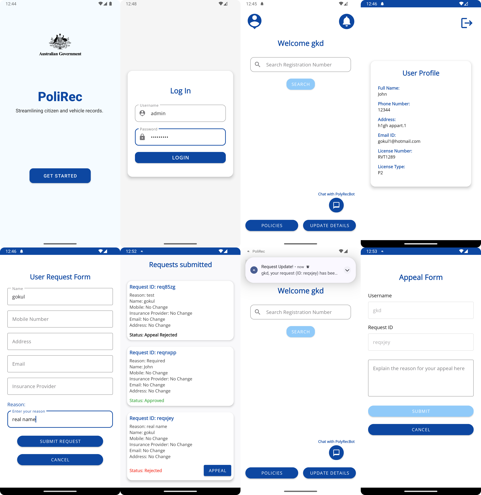
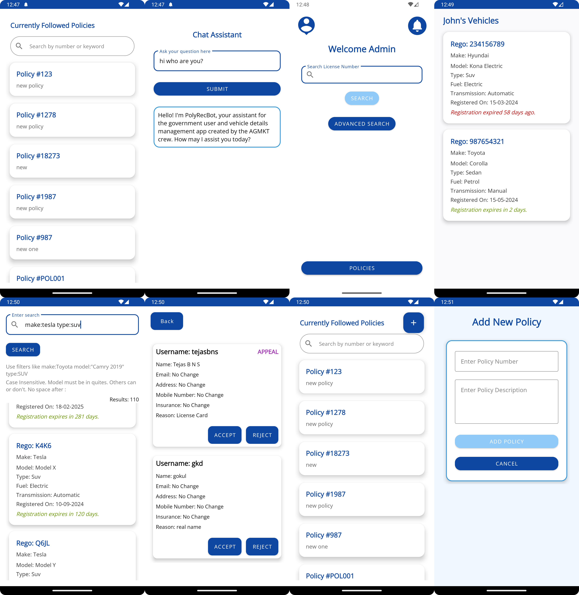

# PoliRec

An Android app that streamlines citizen and vehicle record management for a government context. Built as a university team project, PoliRec provides a dual role system for regular users and administrators to manage vehicle registrations, update personal details, track requests, and interact with an integrated AI chatbot.

## Screenshots

<p float="left">
  
</p>

<p float="left">
  
</p>

## Features

### User
- 🔍 Search vehicles by registration number
- 👤 View personal profile including license details
- 📋 Submit requests to update personal details (name, address, mobile, email, insurance)
- 📬 Track request status: Pending, Approved, Rejected, Appealed, Appeal Rejected
- ⚖️ Appeal rejected requests with a reason
- 📜 Browse and search government policies
- 🔔 Real-time push notifications for request updates and new policies
- 🤖 Chat with **PolyRecBot**: an AI assistant powered by Microsoft Phi-3

### Admin
- 🔍 Search users by license number
- 🔎 Advanced vehicle search using filters (e.g. `make:Tesla type:SUV`)
- ✅ Accept or reject user update requests
- 📋 Add new policies that notify all users

## Tech Stack

- **Language:** Java (Android)
- **Backend/Database:** Firebase Realtime Database
- **AI Chatbot:** Microsoft Phi-3-mini via HuggingFace Inference API
- **Data Structure:** Custom AVL Tree for O(log n) license lookups
- **Architecture:** Multiple design patterns (Strategy, State, Factory, Observer)
- **Build System:** Gradle (Kotlin DSL)

## Design Patterns

- **Strategy**: LLM is abstracted behind `LLMStrategy` interface, making the chatbot provider easily swappable
- **State**: Admin and User roles implemented via `UserState`/`UserSession`, controlling feature access
- **Factory**: `NotificationsFactory` creates the correct notification type (request update, appeal update, policy update)
- **Observer**: `NotificationsListenerService` watches Firebase in real time and triggers push notifications

## Architecture Highlights

- **AVL Tree**: user data is loaded from Firebase into a self balancing AVL tree on login, enabling fast license and registration number lookups without repeated database calls
- **Domain constrained chatbot**: PolyRecBot uses a system prompt to restrict responses to app-related topics, general driving rules, and Australian road policies
- **Foreground notification service**: listens for Firebase changes in the background and delivers real time push notifications for request and policy updates
- **Advanced search tokenizer**: admin vehicle search supports a custom filter grammar (e.g. `make:Toyota model:"Corolla" type:SUV`) with stop word handling

## Getting Started

### Prerequisites
- Android Studio
- Android device or emulator running API 21+
- Firebase project with Realtime Database configured
- HuggingFace API token for the chatbot

### Setup
1. Clone the repository
2. Create a Firebase project at [firebase.google.com](https://firebase.google.com) and add an Android app with the correct package name
3. Download `google-services.json` and place it in `app/`
4. Create `src/app/src/main/assets/LlmConfig.json` with your HuggingFace token:
```json
{
  "api_url": "https://api-inference.huggingface.co/models/microsoft/Phi-3-mini-4k-instruct-fast/v1/chat/completions",
  "hf_token": "Bearer YOUR_HUGGINGFACE_TOKEN"
}
```
5. Open the project in Android Studio, let Gradle sync, and run on your device or emulator

## Testing

The project includes comprehensive unit and integration tests covering:
- AVL Tree operations (insert, search, balance)
- Vehicle search filter logic
- Request and appeal workflows
- Notification logic

## Notes

Built as a university group project in collaboration with a team of 5 developers.